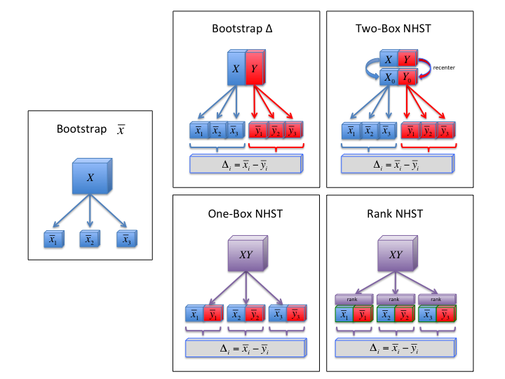

```{r, echo=FALSE}
library(knitr)
knit_hooks$set(purl = function(before, options) {
  if (before) return()
  input  = current_input()  # filename of input document
  output = paste(tools::file_path_sans_ext(input), 'R', sep = '.')
  if (knitr:::isFALSE(knitr:::.knitEnv$tangle.start)) {
    assign('tangle.start', TRUE, knitr:::.knitEnv)
    unlink(output)
  }
  cat(options$code, file = output, sep = '\n', append = TRUE)
})
```

# Introduction
Comparing the means of two independent groups is the most common task of statistical inference. A number of methods exist for this purpose, and we will learn how to implement them in R in this tutorial. We compare parametric, nonparmetric, and bootstrap methods for null hypothesis significance testing and constructing confidence intervals on an example dataset. We focus most of our attention on the bootstrap methods, and how to best implement them. We demonstrate how to go between the usual for-loop bootstrap design, and the much faster vectorized design for R. Finally, we end by providing a few optimized functions for performing bootstrap inference on two groups.

Let's begin by importing some data from a built-in dataset in R. A good example is the dataset CO2, labeled *Carbon Dioxide Uptake in Grass Plants*. The CO2 data frame has 84 rows and 5 columns of data from an experiment on the cold tolerance of the grass species Echinochloa crus-galli. The CO2 uptake of six plants from Quebec and six plants from Mississippi was measured at several levels of ambient CO2 concentration. Half the plants of each type were chilled overnight before the experiment was conducted. We will ignore several of the columns for this tutorial, keeping only the treatment and CO2 uptake variables. Here, we want to test if CO2 uptake is different in chilled and nonchilled plants.

```{r, echo=T}
df <- CO2[,c(3,5)] # import data
summary(df)
head(df,10)

# split the dataframe into two groups
X <- df[df$Treatment=="nonchilled","uptake"]  # nonchilled group
Y <- df[df$Treatment=="chilled","uptake"]   # chilled group

```


## Displaying the data

The first thing we should do is look at the data. The dataset has 42 samples in each group, which is enough for us to be able to get a sense of the distribution. But no single method is perfect for a typical sample size such as this. Boxplots are always useful because they point out the median and quartiles, giving a good depiction of the center and spread, as well as the skew of the distribution. But boxplots don't let us see if there are gaps or multiple peaks (multimodal), which are important indicators of subgroups or more interesting behavior. We then have at least 3 good options to help. Since there are only 42 datapoints in a given boxplot, it's a good idea to plot the individual datapoints, overlayed with the boxplot marking the quantiles. The second option we have is to look at kernel density estimates. Kernel density estimates work by adding noise to each datapoint, which collectively add up by superposition to result in what amounts to a smoothed histogram. This option appears most commonly in what are known as violin plots. The last is a quantile-quantile plot, which plots the quantiles of the data against the quantiles of the theoretical normal distribution. These are useful because they gives us good indicators of violation of normality in the tails. We will therefore look at all 4 ways to display the data in order to understand the distributions.

```{r, eval=T, echo=F}
library(vioplot)
par(mfrow=c(1,2)) # 2 images

# boxplot with stripchart overlayed
boxplot(uptake ~ Treatment, data=df, main="CO2 uptake", ylab="uptake rate (umol/m^2 sec)")
stripchart(uptake ~ Treatment, method="jitter", add=T, data=df, vertical=T, pch=16, col="red")

# violin plot

vioplot(X,Y, names=c("nonchilled","chilled"), col="red", wex=.7, h=3)

``` 

## Assessing normality

Theoretical tests, such as Student's t-test, and Welch's t-test, assume the data is normally distributed, and may produce spurious results when this assumption is violated. So if the violations are large enough, we have some important decisions to make. The boxplots indicate some skew in our data. However, upon looking at the violin plot, it's clear that the chilled group is actually bimodal; it has two clusters. We can explain the presence of this in our data because the CO2 dataset we imported actually has other factors that we discarded for the sake of this tutorial. So we will continue with the bimodality the sake of the tutorial.

Another way to see the non-normality is to look at a normal quantile-quantile plot, which plots the quantiles of the data against the quantiles of a theoretical normal distribution. Here the skew is apparent by the monotonic curve on the left, and the bimodality is apparent by the squiggle on the right.

```{r, echo=F}
par(mfrow=c(1,2))
qqnorm(X, main="Nonchilled QQ Plot")
qqline(X, col="red")

qqnorm(Y, main="Chilled QQ Plot")
qqline(Y, col="red")
```

It's clear, then, that there are deviations from normality in both groups. But another way of verifying this is to use the statistical tests of normality that are available. The Shapiro-Wilk test is a very common one.

```{r}
shapiro.test(X)
shapiro.test(Y)
```

Not surprisingly, both tests reject the hypothesis of normality. We are left to conclude that parametric methods, like Student's t-test and Welch's t-test, may not produce accurate results. Spurious results can lead us to miss true effects, or worse, cause false positives by giving p-values that are too significant. We're therefore interested in a variety of alternative methods, but even methods such as the bootstrap still require other assumptions, such as equality of variance, which we will next examine.

## Assessing equality of variance
The next issue we are interested in is whether the variance of the two groups are equal. Different tests apply if we can't assume the variances of the two groups are equal. Looking at the data, the variance of the two groups look very similar. It seems reasonable to use a test that assumes equal variance.

There are also statistical tests for this, though it's important to recognize that they become underpowered at smaller sample sizes. This means that they have a lower chance of detecting true departures from normality if they really exist. Few people actually recommend using these tests to make decisions, but it's worthwhile to note their existence. If the data is normally distributed, Bartlett's test is the most powerful test to use. However, it is sensitive to data which is not non-normally distribution; it is more likely to return a “false positive” when the data is non-normal. Levene's test is more robust to departures from normality than Bartlett's test. There is also the Fligner-Killeen test, which is a non-parametric test that is very robust against departures from normality.

```{r}
library(car)
bartlett.test(uptake ~ Treatment, data=df)
leveneTest(uptake ~ Treatment, data=df)
fligner.test(uptake ~ Treatment, data=df)
```

None of these tests reject the null hypothesis that the variances in both groups are equal. And it is readily apparent from the boxplots and violin plots that the spreads of the two groups are very similar. We conclude that the data has departures from normality, but that the variances can be considered equal. 

We will now compare methods by which to test the hypothesis that the two samples were drawn from the same population. This is generally quantified by testing the equality of the means of the two groups, but it is also popular to also do nonparametric tests. For the sake of comparison, we will first perform the parametric test (Student's t-test), and then move on to the nonparametric (rank-based) Mann-Whitney U test, and finally several possible bootstrap tests.


# Standard Statistics

## Student's and Welch's t-tests

There are two different tests for equality of means: Student's t-test and Welch's t-test. Student's t-test assumes equal variance, while Welch's test assumes unequal variances. However, this difference should more generally be viewed as whether or not the data came from a single distribution, or two separate distributions with the same mean. So, for example, if there is differing skew, this is also an indicator of which to choose. In general, Welch's t-test is a safe choice, and it doesn't really underperform even when the data really came from a single population. Both are available using the t.test() function in R, and simple setting the flag for equal or unequal variance. The unequal variance option is the default, and is usually recommended. However, we will choose Student's t-test for illustration.

```{r}
# Student's t-test
ttest <- t.test(X, Y, var.equal = T)
pval <- ttest$p.value          # p-value
```

It's important that we not just rely on statistical significance to make inferences about the data. It's just as important to also provide an estimate of the effect size, with a corresponding confidence interval. By effect size, we mean here simply the difference of the group means. But later on, the bootstrap will allow us do the same for the difference in the group medians.

```{r, eval=T, echo=T}
# get effect-size and confidence interval
delta <- -diff(ttest$estimate)  # effect size
delta.CI <- ttest$conf.int    # 95% confidence interval 
```

It's common to write the results, for effect size d with confidence interval, in the notation: d (lowerCL, upperCL).

```{r, echo=F}
# format effect size with confidence interval for printing
label.d <- paste("delta = ", round(delta,2), "(", paste(round(delta.CI,2), collapse=","), ")", sep="")
label.p <- paste("pval = ", signif(pval,2), sep="")
noquote(label.d)
noquote(label.p)
```


We see that the effect of chilling is to statistically significantly decrease CO2 uptake by `r label.d` umol/m^2 sec, `r label.p`. But this confidence interval was constructed using the same theory that is not robust to non-normality. So we should be very interested to compare the p-value and confidence interval with bootstrap methods, which can perform the exact same things without normality assumptions.

## Nonparametric Mann-Whitney-Wilcoxon test

Because the data fails to meet the normality assumption, we may wish to consider using a nonparametric test. The most common test to compare two groups is the Mann-Whitney U test, which is also known as the Wilcoxon test. Athough it is commonly used as a comparison of medians, this interpretation only holds if both distributions have the same shape, and differ only in location. It is more generally testing for stochastic inequality: whether a sample taken from one group is more likely to exceed a sample taken from the other. So the effect size and confidence interval that is returned by the function is not to be interpreted as the difference in medians; we will be able to compute that later with the bootstrap.

```{r}
wilcox <- wilcox.test(X, Y, conf.int=T, correct=F, exact=F)
pval.U <- wilcox$p.value
dU <- wilcox$estimate     # effect size
dU.CI <- wilcox$conf.int  # confidence interval
```

We can format the results for display,

```{r, echo=F}
# format effect size with confidence interval for printing
label.d <- paste("d= ", round(dU,2), "(", paste(round(dU.CI,2), collapse=","), ")", sep="")
label.p <- paste("p= ", signif(pval.U,2), sep="")
noquote(label.d)
noquote(label.p)
```

# Bootstrap statistics

The bootstrap is a method that relies only on resampling the data to estimate the statistical significance. It is also very intuitive to understand and implement. However, a number of different algorithms exist, depending on the assumptions they make about the data. The general set of algorithms is shown in the figure below.

On the left, we see the most primitive form, in which the error on a simple estimator like the mean can be estimated by resampling the data over and over, computing new estimates for each resample. When we extend this concept to two groups, we get 2 possible classes of algorithms: the top row is a class in which the two groups are kept separate, and data is resampled from each separately; the bottom row is a class in which the data is pooled into one group, and data is resampled from this combined big box. In this section, we will show how to implement each of these bootstrap methods.




## One-box bootstrap

To simulate the null hypothesis that the data was sampled from a single population, we simply combine the two groups into one big box. We then resample two new bootstrap groups from this single population, and compute the difference between their means as a test statistic. We repat this thousands of times, and keep track of all the differences in the means. The resulting array represents the distribution of the test statistic under the null hypothesis (for example, when histogrammed). We compute statistical significance by a simple percentile method: counting the number of elements of this array that are equal to or more extreme than the actual test statistic. Because of the symmetric notion of "equal to or more extreme", two-sided pvalues take the form of a inequality of the absolute values of the test statistic and the distribution.

Because we're interested in the difference of the means, we can use that directly as a test statistic here; in the one-box bootstrap, this raw measure works fine, and is the simplest approach. However, the classic t-statistic used by Student also works. The difference is negligible here, but becomes critical in the two-box bootstrap later.

```{r}
# test statistic: difference in means
dstat <- function(x1, x2, center=mean){
    d <- center(x1) - center(x2) 
    return(d)
}

# test statistic: Student's t
tstat <- function(x1, x2, center=mean, spread=sd){ 
    d <- center(x1) - center(x2) # difference in means
    n1 <- length(x1)
    n2 <- length(x2)
    s <- ((n1-1)*spread(x1)^2 + (n2-1)*spread(x2)^2) / (n1+n2-2) / sqrt((1/n1)+(1/n2))
    t <- d/s
    return(t)
} 

```

The one-box bootstrap is implemented as follows

```{r}
nboot <- 10000  # number of bootstraps
d <- numeric()
d0 <- tstat(X,Y)  # actual test statistic
for(i in 1:nboot){
    x <- sample( c(X,Y), length(X), replace=T)  # resample new x group
    y <- sample( c(X,Y), length(Y), replace=T)  # resample new y group
    d[i] <- tstat(x, y)  # bootstrap test statistic
}
p.onebox <- sum(abs(d)>=abs(d0))/nboot  # compute two-sided p-value
```

We should examine the properties of the null distribution. The central limit theorem tells us that it should look approximately normally distributed if our statistic is the difference in means. If the statistic is the t-statistic, then it more precisely follows a t-distribution, which looks like a normal distribution, but with thicker tails at smaller sample sizes. We compare our distribution to the theoretical normal by fitting it to the histogram, as well as by looking at the Q-Q plot.

```{r, echo=F}
par(mfrow=c(1,2)) # 2 images
hist(d, prob=T, breaks="FD", col="white", main=paste("Null Distribution \n p=",p.onebox), xlab="Mean difference d", xlim=c(min(min(d),-abs(d0)),max(max(d),abs(d0))))  # histogram
abline(v=c(d0,-d0), col="red")
lines(seq(min(d), max(d), length.out = 300) -> y, dnorm(y, mean=mean(d), sd=sd(d)), col = "black", lty="dotted", lwd=5) # add dotted best-fit gaussian

qqnorm(d, main="QQ Plot of Bootstraps"); qqline(d, col="red") # Q-Q plot
```

```{r, echo=F}
# bootstrap using vectorization
boot.1 <- function(X, Y, nboot, center = function(x) sum(x) / length(x)){
    x <- matrix(sample(c(X,Y), size = nboot * length(X), replace = TRUE), nboot, length(X))
    y <- matrix(sample(c(X,Y), size = nboot * length(Y), replace = TRUE), nboot, length(Y))
    x.mean <- apply(x, 1, center)
    y.mean <- apply(y, 1, center)
    d <- x.mean - y.mean             # null distribution
    d0 <- dstat(X,Y, center)         # actual test statistic
    p <- sum(abs(d)>=abs(d0))/nboot  # two-sided p-value
    output <- list(pval = p, statistic = d0, bootstraps = d)
    return(output)
}
```

## Two-box bootstrap

The one-box bootstrap assumes both groups were sampled from the same population. But it is common to just want to compare the centers of two distributions knowing full well that they come from different populations. When we say different populations, we usually mean that characteristics such as the variance or the skew are different. So if the two groups have very different variances, for example, it would not be reasonable to say they were sampled from the same population; they exist on two different scales.

This has implications for both how we simulate the null, and what test statistic we should use. To simulate the null hypothesis that the data was sampled from two different populations that have the same mean, we now keep the data separated in two groups, but we recenter each group so that their means are equal. This enforces the null hypothesis that the means are equal. We then resample new bootstrap groups from their parent populations.

But now we can't simply compute the difference between their means as a test statistic; this only works well when the data is assumed to come from the same distribution as in the one-box bootstrap. Now we must "Studentize" the test statistic by dividing it by a scale parameter that looks like the standard error of the mean. But what measure of scale should we use here, since we have two different standard errors? Because we assume the standard errors of the two group means are independent of each other, Welch's version of the t-statistic is the correct version: it simply adds the standard errors of the two groups in a pythagorean relation. 

This process is repeated thousands of times, and we keep track of all the t-statistics. The resulting array represents the distribution of the test statistic under the null hypothesis. Finally, we compute statistical significance by counting the number of elements equal to or more extreme than the actual test statistic.


```{r}
tstat <- function(x1, x2, center=mean, spread=sd){
    d <- center(x1) - center(x2) # difference in means
    s <- sqrt( ((spread(x1)^2)/length(x1)) + ((spread(x2)^2)/length(x2)) )  # Welch's correction
    t <- d/s
    return(t)
} 
```

We then bootstrap the null distribution and compute the p-value.

```{r}
t0 <- tstat(X,Y)  # actual test statistic
X0 <- X - mean(X)  # recenter X
Y0 <- Y - mean(Y)  # recenter Y
t <- numeric()  # initialize
for(i in 1:nboot){
    x <- sample( X0, length(X), replace=T)  # resample new x group
    y <- sample( Y0, length(Y), replace=T)  # resample new y group
    t[i] <- tstat(x, y)  # bootstrap test statistic
}
p.twobox <- sum(abs(t)>=abs(t0))/nboot  # compute two-sided p-value
```

We should examine the properties of the null distribution. 

```{r, echo=F}
par(mfrow=c(1,2)) # 2 images
hist(d, prob=T, breaks="FD", col="white", main=paste("Null Distribution \n p=",p.twobox), xlab="Mean difference d", xlim=c(min(min(d),-abs(d0)),max(max(d),abs(d0))))  # histogram
abline(v=c(d0,-d0), col="red")
lines(seq(min(d), max(d), length.out = 300) -> y, dnorm(y, mean=mean(d), sd=sd(d)), col = "black", lty="dotted", lwd=5) # add dotted best-fit gaussian

qqnorm(d, main="QQ Plot of Bootstraps"); qqline(d, col="red") # Q-Q plot
```


## Rank bootstrap

When we discuss "nonparametric tests", it usually implies that we are discussing rank-based statistics. Converting to ranks is often useful for several reasons. First, it defends against outliers, since the rank is strictly limited by the sample size; no matter how far away an outlier is, it gets brought back to the rest of the data. In the same way, skewed distributions are much better described by rank quantities like quantiles and medians, than they are by means and standard deviation. Finally, when the sample size is small, there is argument that it's not possible to claim normality, and thus ranks are often recommended when working with small samples.

To simulate the null hypothesis that the data was sampled from two different populations that have the same average rank, we resample from a one-box bootstrap as before, but we rank the data after each resampling. This process is repeated thousands of times, and we keep track of all the differences in the mean ranks. The resulting array represents the distribution of the test statistic under the null hypothesis. Finally, we compute statistical significance by counting the number of elements equal to or more extreme than the actual test statistic.

It's going to help us to redefine our test statistic. We will need to rank the data after it is joined into one box, and then split the ranked data back in two before finding the test statistic. Let's define a function to do this:

```{r}

rstat <- function(XY, nX, center=mean){
    iX <- 1:nX  # indices of X in XY
    rXY <- rank(XY)  # rank all
    rX <- rXY[iX]  # split ranks into X
    rY <- rXY[-iX] # split ranks into Y
    rd <- dstat(rX, rY, center)
    return(rd)
}
```

Now, we implement the bootstrap to do a rank test

```{r}
XY <- c(X,Y)  # combine data into one-box
d0 <- rstat(XY, length(X))  # actual test statistic
d <- numeric()
for(i in 1:nboot){
    xy <- sample( XY, replace=T)  # resample new x group
    d[i] <- rstat(xy, length(X))  # bootstrap test statistic
}
p.rank <- sum(abs(d)>=abs(d0))/nboot  # compute two-sided p-value
```

We should examine the properties of the null distribution. 

```{r, echo=F}
par(mfrow=c(1,2)) # 2 images
hist(d, prob=T, breaks="FD", col="white", main=paste("Null Distribution \n p=",p.rank), xlab="Mean difference d", xlim=c(min(min(d),-abs(d0)),max(max(d),abs(d0))))  # histogram
abline(v=c(d0,-d0), col="red")
lines(seq(min(d), max(d), length.out = 300) -> y, dnorm(y, mean=mean(d), sd=sd(d)), col = "black", lty="dotted", lwd=5) # add dotted best-fit gaussian

qqnorm(d, main="QQ Plot of Bootstraps"); qqline(d, col="red") # Q-Q plot
```


## Bootstrap confidence intervals

The process of bootstrapping confidence intervals is naively straightforward. The idea is to simply resample the data directly from the original groups, and compute the effect size for each iteration. The array of these represents the sampling distribution of the effect size, and we find confidence intervals using percentiles. In other words, the resampling process directly simulates the same sampling distribution described by the central limit theorem.

```{r}
d0 <- dstat(X,Y)  # actual test statistic
d <- numeric()  # initialize
for(i in 1:nboot){
    x <- sample( X, length(X), replace=T)  # resample new x group
    y <- sample( Y, length(Y), replace=T)  # resample new y group
    d[i] <- dstat(x, y)  # bootstrap test statistic
}
boot.CI <- quantile(d,c(.025,.975))  # find 95% confidence interval

```

We should examine the properties of the bootstrap distribution. 

```{r, echo=F}
par(mfrow=c(1,2)) # 2 images
hist(d, prob=T, breaks="FD", col="white", main=paste("Bootstrap Distribution \n d=",round(d0,2),",(",paste(round(boot.CI,2),collapse=","),")"), 
     xlab="Mean difference d", xlim=c(min(min(d),-abs(d0)),max(max(d),abs(d0))))  # histogram
abline(v=c(d0,boot.CI), col=c("red","blue","blue"))
lines(seq(min(d), max(d), length.out = 300) -> y, dnorm(y, mean=mean(d), sd=sd(d)), col = "black", lty="dotted", lwd=5) # add dotted best-fit gaussian

qqnorm(d, main="QQ Plot of Bootstraps"); qqline(d, col="red") # Q-Q plot
```

There's also a bootstrapping package that allows for improved 'bca' confidence invtervals. These have better coverage properties, and are preferred over the naive percentile method we are implementing.

```{r}
library(boot)

# test function
diff.means <- function(dat, w) {   
     ix1 <- which(dat[,"Treatment"]=="nonchilled")
     m1 <- sum(dat[ix1,"uptake"] * w[ix1])
     m2 <- sum(dat[-ix1,"uptake"] * w[-ix1])
     m1 - m2
}

result <- boot(df, diff.means, R = nboot, stype = "w", strata = df$Treatment)
bca <- boot.ci(result, type="all")


```

# Comparison of methods

## P-values

```{r, echo=F}
# function that computes t-like statistics
tstat <- function(X.mu, Y.mu, X.sd, Y.sd, X.n, Y.n){
    d <- X.mu - Y.mu
    s <- sqrt( ((X.sd^2)/X.n) + ((Y.sd^2)/Y.n) )  # Welch's correction
    t <- d/s
    return(t)
}

# two-box bootstrap using vectorization
boot.2 <- function(X, Y, nboot, center = function(x) sum(x) / length(x), spread = sd){
    x <- matrix(sample( X-center(X), size = nboot * length(X), replace = TRUE), nboot, length(X))
    y <- matrix(sample( Y-center(Y), size = nboot * length(Y), replace = TRUE), nboot, length(Y))
    x.mean <- apply(x, 1, center)
    y.mean <- apply(y, 1, center)
    x.sd <- apply(x, 1, spread)
    y.sd <- apply(y, 1, spread)
    t <- tstat(x.mean, y.mean, x.sd, y.sd, length(X), length(Y))  # vectorized
    t0 <- tstat(center(X), center(Y), spread(X), spread(Y), length(X), length(Y))
    p <- sum(abs(t) >= abs(t0))/nboot
    output <- list(pval = p, statistic = t0, bootstraps = t)
    return(output)
}

rstat <- function(XY, nX, center=mean){
    iX <- 1:nX  # indices of X in XY
    rXY <- rank(XY)  # rank all
    rX <- rXY[iX]  # split ranks into X
    rY <- rXY[-iX] # split ranks into Y
    rd <- dstat(rX, rY, center)
    return(rd)
}

XY <- c(X,Y)  # combine data into one-box
r0 <- rstat(XY, length(X))  # actual test statistic
d <- numeric()
for(i in 1:nboot){
    xy <- sample( XY, replace=T)  # resample new x group
    d[i] <- rstat(xy, length(X))  # bootstrap test statistic
}
p.rank <- sum(abs(d)>=abs(r0))/nboot  # compute two-sided p-value

require(DescTools)

onebox.med <- boot.1(X,Y,nboot, center=median)
twobox.med <- boot.2(X,Y,nboot, center=median, spread=function(x) MeanAD(x, FUN=median))

# Bootstrap effect size and confidence interval using vectorization
boot.effect <- function(X, Y, nboot, alpha=0.05, center = function(x) sum(x) / length(x)){
    x <- matrix(sample( X, size = nboot * length(X), replace = TRUE), nboot, length(X))
    y <- matrix(sample( Y, size = nboot * length(Y), replace = TRUE), nboot, length(Y))
    x.mean <- apply(x, 1, center)
    y.mean <- apply(y, 1, center)
    d <- x.mean - y.mean             # null distribution
    d0 <- dstat(X,Y, center)         # actual test statistic
    output <- list(effect = d0, ci = quantile(d, c(alpha/2, 1-(alpha/2))), bootstraps = d)
    return(invisible(output))
}

effect.med <- boot.effect(X,Y,nboot, center=median)

```


Here we compare the p-values that were generated by each method. We see that Student's t-test and the one-box and two-box bootstrap agree very well. The rank tests, on the other hand, have larger p-values (worse power). This is known to be the case in general, and is one of the considerations to take into account when choosing to use a nonparametric method. Finally, the median tests have the worst power of all the options. 

```{r, echo=F}
p.comparison <- data.frame(t=round(pval,4),  
                         #LMboot=pval.lmboot[-4], 
                         onebox=p.onebox, 
                         twobox=p.twobox, 
                         rank=round(pval.U[-4],4), 
                         rankboot=p.rank,
                         onebox.med=onebox.med$pval,
                         twobox.med=twobox.med$pval)
rownames(p.comparison) <- c("p-value")
colnames(p.comparison) <- c("Student's t-test", "Bootstrap (one-box)", "Bootstrap (two-box)", "Mann-Whitney U test", "Bootstrap (rank)", "Bootstrap (one-box, median)", "Bootstrap (two-box, median)")
table <- t(p.comparison)
```

```{r kable, echo=F}
library(knitr)
kable(table, digits=4)
```

## Confidence intervals
Here we compare the confidence intervals that were generated by each method. It's clear by looking at the table that the Mann-Whitney U effect size and confidence interval is not the same as the median's. It's also noteworthy that there's a fair amount of variation among all the confidence intervals around the mean difference. This gives us a good idea of how uncertain a particular result is when reading or quoting confidence intervals.

```{r, echo=F}
d.comparison <- data.frame(d=c(round(delta,4),round(delta.CI,4)),  
                         #LMboot=pval.lmboot[-4], 
                         u=c(round(dU,4), round(dU.CI,4)),
                         med1=c(effect.med$effect, effect.med$ci),
                         boot=c(d0, boot.CI),
                         bca=c(bca$t0, bca$bca[4:5]),
                         normal = c(bca$t0, bca$normal[2:3]),
                         basic = c(bca$t0, bca$basic[4:5]),
                         pct= c(bca$t0, bca$percent[4:5]))

                         
rownames(d.comparison) <- c("d", "Lower 95% CL", "Upper 95% CL")
colnames(d.comparison) <- c("Student", "Mann-Whitney","Bootstrap (median)", "Bootstrap (naive percentile)", "bca", "normal", "basic", "percentile")
table <- t(d.comparison)
```

```{r kable2, echo=F}
library(knitr)
kable(table, digits=4)
```


```{r, echo=F}
d.onebox <- function(xy, ix, center=mean){
    x.mean <- apply(xy[,ix], 1, center)
    y.mean <- apply(xy[,-ix], 1, center)
    x.mean - y.mean
}

d.twobox <- function(x, y, center=mean){
    x.mean <- apply(x, 1, center)
    y.mean <- apply(y, 1, center)
    x.mean - y.mean
}

rank.onebox <- function(xy, ix, center=mean){
    rxy <- t(apply(xy, 1, rank))
    rx.mean <- apply(rxy[,ix], 1, center)
    ry.mean <- apply(rxy[,-ix], 1, center)
    rx.mean - ry.mean
}

d.effect <- function(x1, x2, center=mean) center(x1) - center(x2) # test statistic

rank.effect <- function(XY, nX, center){
    iX <- 1:nX  # indices of X in XY
    rXY <- rank(XY)  # rank all
    rX <- rXY[iX]  # split ranks into X
    rY <- rXY[-iX] # split ranks into Y
    rd <- d.effect(rX, rY, center)
    return(rd)
}

boot.interval <- function(x, y, alpha=0.05, center=mean){
    x.mean <- apply(x, 1, center)
    y.mean <- apply(y, 1, center)
    d <- x.mean - y.mean
    quantile(d, c(alpha/2, 1-alpha/2))
}

formula.tests <- function(X, Y, alpha=0.05){
    ttest <- t.test(X, Y, var.equal=T, conf.level=(1-alpha)) # Student
    ttest2 <- t.test(X, Y, var.equal=F, conf.level=(1-alpha)) # Welch
    Utest <- wilcox.test(X, Y, exact=F, correct=F, conf.int=T, conf.level=(1-alpha))
    pval <- data.frame(ttest = ttest$p.value, welch = ttest2$p.value, mw = Utest$p.value)
    ci <- data.frame(ttest = ttest$conf.int, welch = ttest2$conf.int, mw = Utest$conf.int)
    effect <- data.frame(ttest=-diff(ttest$estimate), utest=Utest$estimate)
    return(list(effect=effect, ci=ci, p=pval))
}
```

```{r, echo=F}
# the main function
twogroup <- function(X, Y, R=1000, alpha=0.05, center = function(x) sum(x) / length(x)){
    nx <- length(X)
    ny <- length(Y)
    ntot <- nx + ny
    ix <- 1:nx 
    
    # formula-based tests
    results <- formula.tests(X, Y, alpha)  # formula tests
    
    # effect sizes
    d.0 <- d.effect(X, Y, center)  # effect size for mean difference
    d.0.med <- d.effect(X, Y, center=median)  # effect size for median difference
    d.r0 <- rank.effect(c(X,Y), nx, center)  # effect size for rank difference
    
    # one-box statistics
    xy <- matrix(sample(c(X,Y), R*ntot, replace = T), R, ntot)
    d.1 <- d.onebox(xy, ix, center)  # one-box mean null
    d.1.med <- d.onebox(xy, ix, median)  # one-box median null
    d.r <- rank.onebox(xy, ix, center)  # rank null
    
    # two-box sampling
    x <- matrix(sample(X, R*nx, replace = T), R, nx)
    y <- matrix(sample(Y, R*ny, replace = T), R, ny)
    d.2 <- d.twobox(x-center(X), y-center(Y), center)  # two-box null
    d.2.med <- d.twobox(x-median(X), y-median(Y), center=median)  # two-box null
    
    # confidence intervals
    d.ci <- boot.interval(x, y, alpha, center)  # confidence interval on mean difference
    d.ci.med <- boot.interval(x, y, alpha, median)  # confidence interval on median difference
    
    # output tables
    pvalue <- data.frame(Student = results$p$ttest,
                         Welch = results$p$welch,
                         onebox.mean = sum(abs(d.1) >= abs(d.0))/R, 
                         twobox.mean = sum(abs(d.2) >= abs(d.0))/R,
                         onebox.median = sum(abs(d.1.med) >= abs(d.0.med))/R, 
                         twobox.median = sum(abs(d.2.med) >= abs(d.0.med))/R,
                         rankboot = sum(abs(d.r) >= abs(d.r0))/R,
                         Wilcox = results$p$mw)
    ci <- data.frame(d.mean = d.ci, 
                     d.median = d.ci.med,
                     d.ttest = results$ci$ttest,
                     d.welch = results$ci$welch,
                     d.wilcox = results$ci$mw)
    effect <- data.frame(d.mean = d.0, d.median = d.0.med, u = results$effect$utest)
    list(effect=effect, ci=ci, pvalue=pvalue)
}
```


```{r, eval=F, echo=F}
alltest <- twogroup(X,Y, 10000)
```

# Optimization for R

At this point, it should be noted that the for-loop approach to implementing the bootstrap, despite being incredibly intuitive, is computationally inefficient in most programming languages. A more efficient approach uses vectorization, in which the resampling for all of the iterations is performed upfront and stored in a giant matrix, and then subsequent functions are applied to entire rows at a time. 

The idea behind this is that every time a function is called, there is a bit of work passing around information like memory allocation and addresses. So if you need to run a function over all the values in a vector, you could call the R function repeatedly for each value, or you could either pass a whole vector through the R function to the compiled code. When you call the function only once, with a vector, the whole process of memory management happens just once. When a large number of bootstrap iterations are being used, the gain in speed can be impressive.

```{r}
# fast bootstrap
x <- matrix(sample(c(X,Y), size = nboot * length(X), replace = TRUE), nboot, length(X))
y <- matrix(sample(c(X,Y), size = nboot * length(Y), replace = TRUE), nboot, length(Y))
x.mean <- apply(x, 1, mean)
y.mean <- apply(y, 1, mean)
d <- x.mean - y.mean        # null distribution
d0 <- dstat(X,Y)            # actual test statistic
sum(abs(d)>=abs(d0))/nboot  # two-sided p-value
```

## Benchmarking

We can show how much faster this implementation is by benchmarking. Surprisingly, we also find that replacing the standard mean(x) function with sum(x)/length(x) gives an enormous gain; mean(x) is slower because it makes two passes over the vector to be more numerically accurate.

```{R, eval=T}
# bootstrap using for-loop implementation
boot.loop <- function(X, Y, nboot){
    d <- numeric()
    d0 <- dstat(X,Y)  # actual test statistic
    for(i in 1:nboot){
        x <- sample( c(X,Y), length(X), replace=T)  # resample new x group
        y <- sample( c(X,Y), length(Y), replace=T)  # resample new y group
        d[i] <- dstat(x, y)  # bootstrap test statistic
    }
    p <- sum(abs(d)>=abs(d0))/nboot  # compute two-sided p-value
    return(list(pval = p, statistic = d0, bootstraps = d))
}

# bootstrap using vectorization
boot.1 <- function(X, Y, nboot, center = function(x) sum(x) / length(x)){
    x <- matrix(sample(c(X,Y), size = nboot * length(X), replace = TRUE), nboot, length(X))
    y <- matrix(sample(c(X,Y), size = nboot * length(Y), replace = TRUE), nboot, length(Y))
    x.mean <- apply(x, 1, center)
    y.mean <- apply(y, 1, center)
    d <- x.mean - y.mean             # null distribution
    d0 <- dstat(X,Y, center)         # actual test statistic
    p <- sum(abs(d)>=abs(d0))/nboot  # two-sided p-value
    output <- list(pval = p, statistic = d0, bootstraps = d)
    return(output)
}

library(microbenchmark)
timings <- microbenchmark(boot.loop(X,Y,100), boot.1(X,Y,100,mean), boot.1(X,Y,100) )
```

```{r kable_timings, echo=F}
library(knitr)
kable(summary(timings))
```


## Optimized Code

We'll end this tutorial with some optimized code for the bootstrap algorithms. These functions all make use of vectorization, and run fairly quickly when the faster versions of the mean and standard deviation are used. 

```{r}
# faster mean and standard deviation
mean.fast <- function(x) sum(x) / length(x)
sd.fast <- function(x){
    mu <- mean.fast(x)
    sqrt(sum((x - mu)^2) / (length(x)-1))
}


# function that computes test statistics and effect sizes
tstat <- function(Xbar, Ybar, Xsd, Ysd, Xn, Yn, type="unequal.var"){
    d <- Xbar - Ybar
    if(type == "equal.var"){ # Student's statistic
        s <- sqrt( ((Xn-1)*Xsd^2 + (Yn-1)*Ysd^2) / (Xn + Yn - 2) ) * sqrt((1/Xn) + (1/Yn))
    } else if(type == "unequal.var"){  # Welch's statistic
        s <- sqrt( ((Xsd^2)/Xn) + ((Ysd^2)/Yn) )  
    } else if(type == "Cohen") {  # Cohen's d
        s <- sqrt( ((Xn-1)*Xsd^2 + (Yn-1)*Ysd^2) / (Xn + Yn - 2) ) 
    } else if(type == "delta") {  # simple difference in means
        s <- 1
    }
    t <- d/s
    return(t)
}

# function to bootstrap pvalues. can do any bootstrap test
boot_stats <- function(xy, X, Y, middle=mean.fast, spread=sd.fast, type="unequal.var", rank=F){
        nx <- length(X)
        ny <- length(Y)
        x.mean <- apply(xy[, (1:nx)], 1, middle)
        y.mean <- apply(xy[,-(1:nx)], 1, middle)
        x.sd <- apply(xy[, (1:nx)], 1, spread)
        y.sd <- apply(xy[,-(1:nx)], 1, spread)
        t <- tstat(x.mean, y.mean, x.sd, y.sd, nx, ny, type=type)
        if(rank==T){xyr <- rank(c(X,Y)); X <- xyr[1:nx];  Y <- xyr[-(1:ny)] }
        t0 <- tstat(middle(X), middle(Y), spread(X), spread(Y), nx, ny, type=type)
        p <- sum(abs(t) >= abs(t0))/dim(xy)[1]
        return( list(p = p, t0 = t0, t = t, X.mu = x.mean, Y.mu = y.mean, X.s = x.sd, Y.s = y.sd))
}

```

To perform any of the bootstrap tasks, these simple commands can be used

```{r, eval=F, echo=T}
# use common names for the center (mean, median) and spread (stddev, abs dev)
center <- mean.fast
spread <- sd.fast
nboot <- 10000


# one-box test
xy <- matrix(sample(c(X,Y), size = nboot * length(c(X,Y)), replace = TRUE), nboot, length(c(X,Y))) 
onebox <- boot_stats(xy, X, Y, middle=center, spread=spread, type="equal.var")

# rank test
xy <- matrix(sample(c(X,Y), size = nboot * length(c(X,Y)), replace = TRUE), nboot, length(c(X,Y)))  
xy.rank <- t(apply(xy, 1, rank)) # rank
onebox.rank <- boot_stats(xy.rank, X, Y, middle=mean.fast, type="delta", rank=T)  

# two-box
x <- matrix(sample(X-center(X), size = nboot * length(X), replace = TRUE), nboot, length(X))  # x residuals
y <- matrix(sample(Y-center(Y), size = nboot * length(Y), replace = TRUE), nboot, length(Y))  # y residuals
twobox <- boot_stats(cbind(x,y), X, Y, middle=center, spread=spread, type="unequal.var")

# effect size with confidence interval
x <- matrix(sample(X, size = nboot * length(X), replace = TRUE), nboot, length(X))  # x
y <- matrix(sample(Y, size = nboot * length(Y), replace = TRUE), nboot, length(Y))  # y
effectsize <- boot_stats(cbind(x,y), X, Y, middle=center, type="delta")
effectsize.d <- boot_stats(cbind(x,y), X, Y, middle=center, type="Cohen")

```


When sample sizes are very very small, bootstrapping some statistics like the t-statistic can have some problems because it divides by the standard deviation. Thus in extreme cases when only one unique datapoint gets resampled into a group, the standard deviation goes to zero and an error occurs. In this case it helps to add a little random noise to every resample, just to prevent this kind of pathology. 

There are no fixed guidelines for how much noise to add. However, we don't want the noise to actually contribute to the results, so we should keep it relatively small...smaller than the standard error of either of the groups alone.

```{r, eval=F, echo=T}
# two-box
x <- matrix(sample(X-center(X), size = nboot * length(X), replace = TRUE), nboot, length(X))  # residuals
y <- matrix(sample(Y-center(Y), size = nboot * length(Y), replace = TRUE), nboot, length(Y))  # residuals
    
# dither noise for small samples
noise <- matrix(rnorm(nboot*length(c(X,Y)), 0, min(sd(X),sd(Y))/length(c(X,Y))^(3/2)), nboot, length(c(X,Y)))

# compute p-values
twobox <- boot_stats(cbind(x,y) + noise, X, Y, middle=center, spread=spread, type="unequal.var")
```


```{r, eval=F, echo=F}
one <- boot.1(X,Y,nboot)                               # one-box NHST on means
one.med <- boot.1(X,Y,nboot, center=median)            # one-box NHST on medians
one.rank <- boot.1(X,Y,nboot, rank=T)                  # one-box NHST on ranks
two <- boot.2(X,Y,nboot)                               # two-box NHST on means
two.med <- boot.2(X,Y,nboot, center=median)            # two-box NHST on medians
effect <- boot.effect(X,Y,nboot)                       # mean difference effect size and confidence interval
effect.med <- boot.effect(X,Y,nboot, center=median)    # median difference effect size and confidence interval
```


```{r, eval=F, echo=F}
one$pval
one.med$pval
one.rank$pval
two$pval
two.med$pval
```


# Summary

Comparing the means of two independent groups is the most common task of statistical inference. A number of methods exist for this purpose, and in this tutorial we learned how to implement them in R. We compared parametric, nonparmetric, and bootstrap methods for null hypothesis significance testing and constructing confidence intervals on an example dataset. We developed the bootstrap techniques using an intuitive for-loop approach, and then demonstrated how to implement the much faster vectorized design. The final result of this tutorial is a chunk of optimized code to perform two-group comparisons using a variety of bootstrap methods and test statistics.
